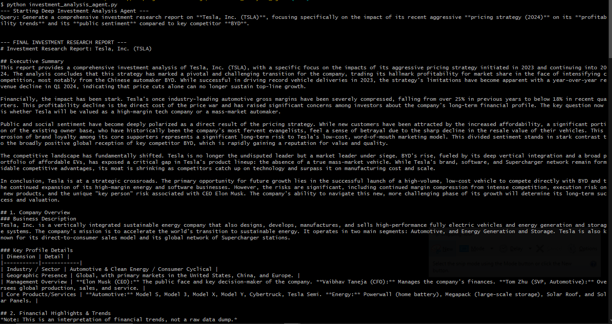

# Investment Analysis Agent

A Deep Research Agent that autonomously gathers, analyzes, and synthesizes publicly available information about a company to generate a comprehensive investment research report.

## Overview

This agent conducts thorough, multi-faceted research on a single public or well-known private company and produces a structured investment research report suitable for financial professionals (e.g., investment bankers or analysts).

## Features

The agent covers all required research dimensions:

1. **Company Discovery & Profiling** - Business description, industry/sector, geographic presence, key products/services, management overview
2. **Financial & Regulatory Research** - Annual reports, quarterly results, investor presentations, regulatory filings with trend analysis
3. **News & Media Intelligence** - Recent corporate events, acquisitions, fundraises, partnerships, controversies, management changes
4. **Social & Public Sentiment Analysis** - Customer, employee, and investor sentiment from social media, forums, and public discussions
5. **Market & Competitive Context** - Key competitors, industry positioning, market dynamics, competitive advantages/disadvantages
6. **Insight Synthesis** - Non-obvious connections across data points, structured observations, opportunities and risks

## Setup

### Prerequisites

- Python 3.13+
- API keys:
  - `TAVILY_API_KEY` - For web search functionality
  - `GOOGLE_API_KEY` - For Google Gemini LLM (or configure your preferred LLM)

### Installation

1. Navigate to the investment analysis agent directory:
```bash
cd investment_analysis_agent
```

2. Install dependencies:
```bash
pip install -r requirements.txt
```

Or using `uv`:
```bash
uv sync
```

3. Create a `.env` file with your API keys:
```env
TAVILY_API_KEY=<your_tavily_api_key>
GOOGLE_API_KEY=<your_google_api_key>
```

## Usage

### Using LangGraph Platform

1. In first terminal launch the LangGraph platform server:
```bash
uv run langgraph dev
```

2. In Second terminal with virtual env enabled run:

```bash
python investment_analysis_agent.py

```

## Example Report Output




## Output

The agent generates a structured Markdown report (`investment_research_report.md`) containing:

- Executive Summary
- Company Overview
- Financial Highlights & Trends
- Key News & Corporate Events
- Public & Social Sentiment Overview
- Market & Competitive Context
- Key Observations & Synthesis (Analyst Notes)
- Opportunities & Risks
- Sources

## Example Query

```
Generate a comprehensive investment research report on Tesla, Inc. (TSLA), 
focusing specifically on the impact of its recent aggressive pricing strategy (2024) 
on its profitability trends and its public sentiment compared to key competitor BYD.
```

## Notes

- The agent uses only publicly available information
- Financial analysis focuses on trends and interpretation rather than exact numeric precision
- The agent prioritizes research depth, structured thinking, and synthesis quality
- All sources are properly cited in the final report
